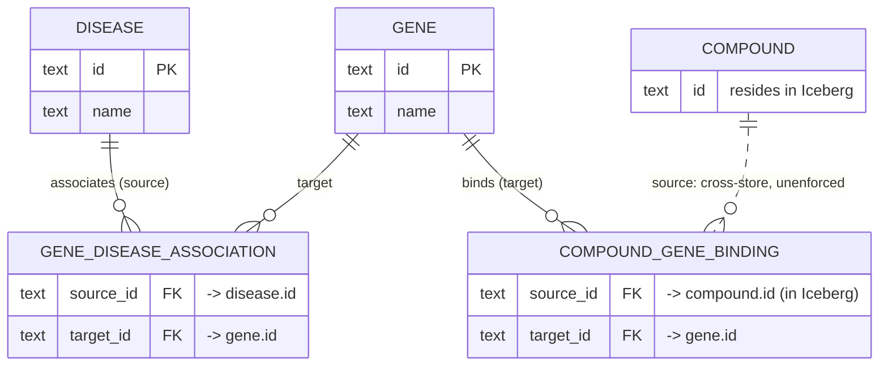
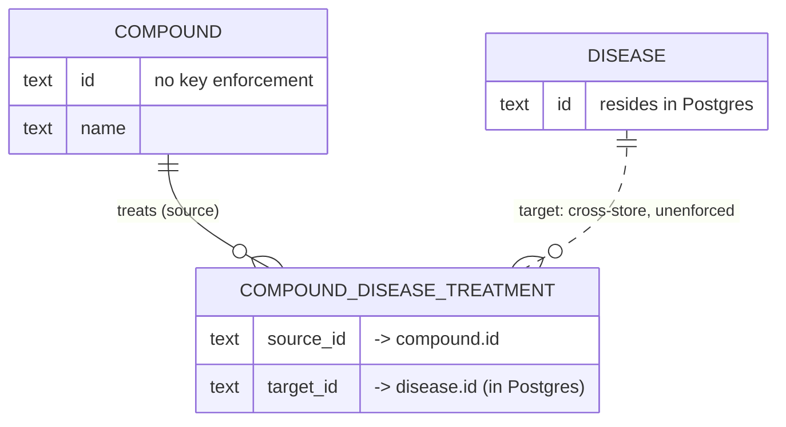
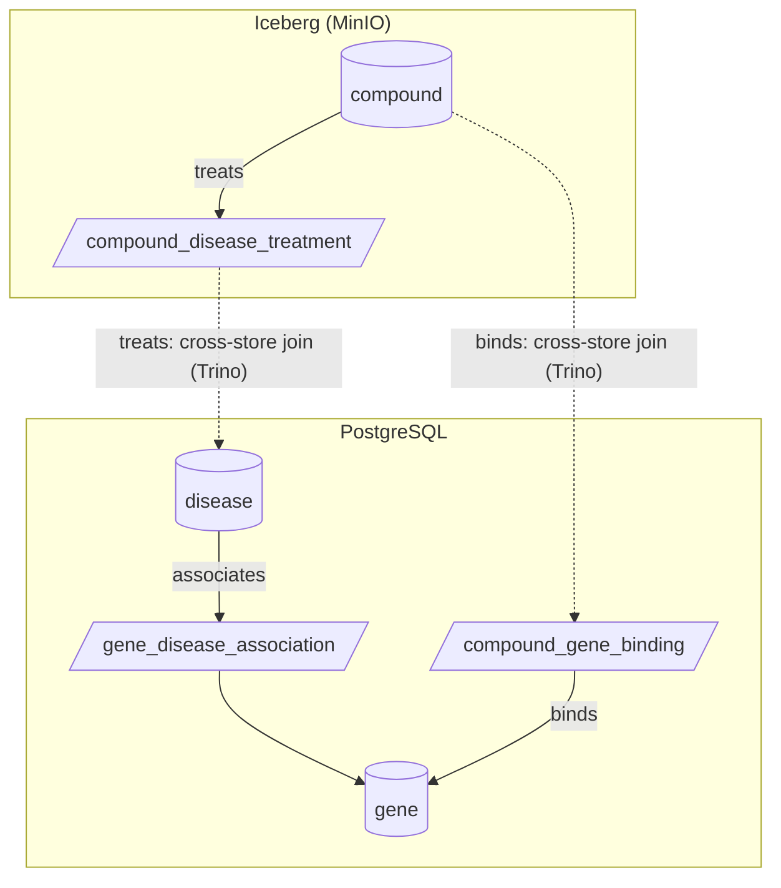

# virtual-knowledge-graph-connectivity

A focused harness that de-risks the **Virtual Knowledge Graph (OBDA)** plumbing for
`biomedical-rag-bench` Project 2, in isolation from the benchmark's retriever and eval code.
It proves that a hand-written SPARQL query resolves — unchanged — down through
**standalone Ontop → Trino → a polyglot ABox (PostgreSQL + Apache Iceberg on MinIO)**, and that
the bindings match a trusted GraphDB baseline.

## What this tests, precisely

 serving topology 
 GraphDB in graph materialized Abox 
 vs
VKG poliglot queries

Because the query is fixed and human-authored, and reasoning is off, any difference in results
between rungs is caused by the **serving layer alone**. That is the entire point.

## The invariant: parity, not improvement

A rung is **correct iff it returns the same bindings as the GraphDB ground truth**, compared on the
**label projection** (the human-readable `?xLabel` columns), modulo ordering. Entity IRIs are
*not* compared — Ontop mints its own IRI scheme here, and matching Project-1's exact
URIs is a benchmark-integration concern, not a connectivity one.

The only metric that legitimately moves between rungs is **virtualization fidelity loss** — rows
the ground truth returns that Ontop drops (a mapping gap, a type coercion, or a join-pushdown limit).
That is a data-quality number, reported as such. "Same results as GraphDB" is a PASS.

## Architecture

```
        hand-written .rq (queries/)
                 │
                 ▼
        ┌──────────────────┐         ┌──────────────────────────┐
        │  standalone Ontop│  ── vs ─│  GraphDB ground truth    │
        │  (system under   │  parity │  (materialized RDFS ABox)│
        │   test)          │  on     └──────────────────────────┘
        └────────┬─────────┘  labels
                 │ SQL
        rung 2 ──┤ (JDBC → Postgres directly)
        rung 3 ──┤ (JDBC → Trino ─→ iceberg catalog ─→ MinIO)
        rung 4 ──┘ (JDBC → Trino ─→ postgresql + iceberg catalogs)
```

**Ontop** is the SPARQL↔SQL layer and binds to **one** SQL source per instance. **Trino** is the
federation layer that presents Postgres + Iceberg as one SQL surface for Ontop to map over. They
are stacked, not alternatives — Trino speaks no SPARQL and knows nothing of the ontology, so it
cannot replace Ontop; Ontop speaks no S3/Iceberg, so it cannot replace Trino.

**Iceberg is always fronted by Trino.** Iceberg is a table format with no query engine of its
own, so there is no "Ontop → Iceberg" path — Trino's Iceberg connector reads it from MinIO.

## Data

Source of truth is the Hetionet **TSV** distribution (topology + labels), **not** the metagraph
JSON (which is the schema, not instances):

- `hetionet-v1.0-nodes.tsv` — `id` (e.g. `Gene::5743`), `name`, `kind`
- `hetionet-v1.0-edges.sif.gz` — `source`, `metaedge` (abbreviation), `target`

These are already relational, so loading is two flat files, not a triple-to-table transform. Node
and edge **attributes** (chromosome, inchikey, description, url) are absent from the TSVs — they
live only in the full JSON and are **out of scope** here.

This repo loads a representative **slice**: nodes `{Gene, Disease, Compound}`, edges
`{Disease–associates–Gene, Compound–binds–Gene, Compound–treats–Disease}`, distributed so that at
least one edge on each store forces a cross-store join. See `STRUCTURE.md` for the table layout.

## Relational model (ERD)

Mermaid's `erDiagram` cannot group entities into bounded per-database boxes — grouping exists only
in `flowchart` — so each store gets its own ERD, followed by a combined boundary view that shows
where the two must be federated.

Enforced keys (`PK`/`FK`) are shown only for PostgreSQL. **Iceberg enforces neither**: identifiers
there are advisory and referential integrity is the query engine's problem, not the store's.
**Dashed** relationships are **cross-store** — a foreign key whose target table lives in the *other*
database, which no RDBMS enforces. Those dashed edges are the joins Trino resolves at rung 4.

### PostgreSQL



### Iceberg (on MinIO)



### Combined — where federation happens

Solid edges stay inside one store; the two dashed edges cross the boundary and are exactly what
Trino federates at rung 4. Node tables are cylinders, association (junction) tables are parallelograms.



## The ground truth

By default the harness points at your **existing Project-1 GraphDB** (`GROUND_TRUTH_SPARQL_URL` in
`secrets/.env`, base `http://localhost:7200/`). Because that graph and the SQL tables come from different provenance paths, parity is
compared on labels 
For reference smoke (partial) and full ABOX RDF is data/hetionet/rdf 


## Running it

Prereqs: Docker + Docker Compose, Python 3.11+, `make`. Config/secrets live in `secrets/.env`
(copy from `secrets/.env.example`).

### Rung 0 — liveness (Ontop → Postgres)

```
make deps        # .venv (editable install) + pinned Postgres JDBC driver — one-time
make up-rung0    # start Postgres (self-seeds 8 genes via initdb) + standalone Ontop
make test-rung0  # q08 (SELECT * LIMIT 1) returns a binding → endpoint is live
make smoke       # same query, prints rows + telemetry dict
make ui          # prints the Ontop console URL
```

The SPARQL console is Ontop's built-in **YASGUI** at <http://localhost:7300/> — syntax
highlighting out of the box. This 5.5.0 build's YASGUI has **no "View SQL" button**; the SPARQL→SQL
rewrite is exposed at the HTTP endpoint `GET /ontop/reformulate?query=…` — use `make sql
Q=<file.rq>` (or open the URL) to see the SQL Ontop pushes to the source. `make down` stops
containers (keeps data); `make clean` also drops the `pgdata` volume (forces a re-seed on next `up`).

### Rung 2 — Ontop → Postgres (parity)

The full Postgres slice — every `Gene` and `Disease` node plus every `Disease–associates–Gene`
(DaG) edge — served directly from Postgres and checked for label parity against the ground truth.

```
make up-rung2       # Postgres + Ontop with the full postgres.obda mapping
make load-postgres  # fetch TSVs → filter the slice → COPY gene/disease/gene_disease_association
make test-rung2     # label parity for q02, q05 vs the GraphDB ground truth
make parity         # same check, printed as a per-query diff + fidelity-loss dict
```

`make load-postgres` runs the `ingest/` pipeline: `fetch.py` pulls the Hetionet TSVs (the
`edges.sif.gz` is Git-LFS-tracked, so it comes from the LFS media host, not `raw.`), `build_tables.py`
filters to the slice's node kinds and metaedges (`DaG`/`CbG`/`CtD`, casing confirmed against
`metaedges.tsv`), and `load_postgres.py` creates the schema and `COPY`s the three PG-resident tables.
It **supersedes the rung-0 8-gene seed** — `TRUNCATE` + `COPY` replaces `gene` with all 20,945.

The queries bind entities by **label, never by IRI** (`?d rdfs:label "restless legs syndrome"`),
so a single `.rq` runs unchanged on Ontop and on GraphDB despite their different IRI schemes
(`https://het.io/…` vs `ncbigene:`/`do:`), and each projects only its label/scalar columns —
the parity comparison never sees an IRI. `q02` (12 genes) and `q05` (20,945 genes) both PASS.

To watch the rewrite as you tune the mapping, `make sql Q=queries/q02_disease_associates_gene.rq`
prints the pushed SQL (a single `disease ⋈ gene_disease_association ⋈ gene` join with the label as a
`WHERE` predicate); `make sql Q=queries/q05_count_genes.rq` shows the `COUNT(*)` delegated straight
to Postgres.

**Compare UI** — `make ui-app` serves a local page at <http://localhost:7400/> that runs one query
against both engines and shows them side by side: virtual (Ontop→Postgres) vs materialized (GraphDB),
each endpoint's telemetry, a latency bar, the parity verdict, and Ontop's SQL translation. A
**Raw ↔ Labels** toggle makes the invariant visible — in Raw the `?gene` IRI columns disagree
(`het.io/gene/…` vs `identifiers.org/ncbigene/…`); in Labels those IRI columns are dropped and the
rows match. It is a live tool (not a Claude Artifact — those can't call the endpoints), so the rung-2
stack must be up. A tiny stdlib server (`ui/server.py`) proxies both endpoints server-side, reusing
`run_query`/`parity`, so the browser stays same-origin (no CORS).

> Editing a mapping while Ontop is running trips a WSL/9p stale bind-mount on `restart`; use
> `make down && make up-rung2` (a container **recreate**) so the new `.obda` is re-mounted and parsed.

### Rung 3 — Ontop → Trino → Iceberg (parity)

The lakehouse leg. The `compound` node table lives in **Apache Iceberg on MinIO**; Iceberg has no
query engine, so a **second** standalone Ontop is pointed at **Trino**, whose Iceberg connector reads
the table from MinIO through a catalog. Same SPARQL endpoint (`:7300`), same parity contract — only
the physical source moved off Postgres and behind a federation engine.

```
make down          # free :7300 if rung 0/2 is up (rung Ontops share the host port)
make up-rung3      # minio + nessie (catalog) + trino + Ontop→Trino; blocks until Trino is healthy
make load-iceberg  # CREATE SCHEMA/TABLE + INSERT the 1,552 compounds into iceberg.hetionet via Trino
make test-rung3    # label parity for q01 (list compounds) + q06 (COUNT) vs the GraphDB ground truth
make parity-rung3  # same, printed as the per-query diff + fidelity-loss dict
```

`q01` (1,552 compound labels) and `q06` (COUNT → 1,552) both PASS. `make sql
Q=queries/q01_list_compounds.rq` shows the SQL Ontop pushes to **Trino** (`SELECT … FROM "compound"`,
the Iceberg table resolved via the JDBC URL's default `iceberg/hetionet`) — this is the same
`reformulate` view that will prove the cross-catalog scans at rung 4.

**Catalog choice — Nessie.** Trino's Iceberg connector needs a catalog implementation (REST, Nessie,
or Hive Metastore) plus S3 config; the values are version-sensitive, so they mirror the Ontop team's
known-working `ontopic-vkg/ontop-trino-iceberg-playground` (Nessie) and were re-checked against the
Trino 478 docs. Nessie is the lightest that works here: a single container with an **in-memory version
store** — it tracks only catalog pointers (namespaces/table metadata); the parquet + Iceberg metadata
live in MinIO. Trino uses its **native S3** file system (`fs.native-s3.enabled=true`, path-style) — no
Hadoop. Pins: `trinodb/trino:478`, `ghcr.io/projectnessie/nessie:0.108.1`, MinIO
`RELEASE.2025-09-07T16-13-09Z`. Only Trino holds the S3 credentials (injected via Trino's `${ENV:…}`
substitution from `secrets/.env`), so no secret sits in a tracked file.

> **Two rung-3 gotchas.** (1) Every service is profile-gated, so a plain `docker compose down` skips
> them — `make down` now uses `--profile "*"`. (2) Nessie's in-memory store means a container recreate
> drops the catalog pointers (the data stays in MinIO); just re-run `make load-iceberg` — that is the
> rung's normal `up → load` flow, and the loader's `DROP TABLE IF EXISTS` makes it idempotent.

Rung 4: TBD.

## Explicitly out of scope (deferred, on purpose)

- **LLM SPARQL writer** — connectivity is validated with human-written queries.
- **OWL reasoning** — Project 3.
- **Node/edge attributes** — not in the TSVs; add from JSON later if a query needs them.
- **All 24 metaedges** — the slice proves the pattern; expansion is mechanical.
- **Cross-database foreign keys / persistent identifiers.** An edge table in one store with a
  key into a node table in another cannot be enforced by either RDBMS — the only key that
  survives the boundary is the node's global identifier, which Trino joins on as a bare string.
  That id-as-global-key is the FAIR **Interoperability** seam where persistent identifiers and
  controlled vocabularies enter a later project. Here, joins are unenforced by design.
- **GraphDB-embedded Ontop** — standalone Ontop exposes the same SPARQL endpoint; swapping to
  GraphDB's virtual repository later is an endpoint-level change, not a rewrite.

