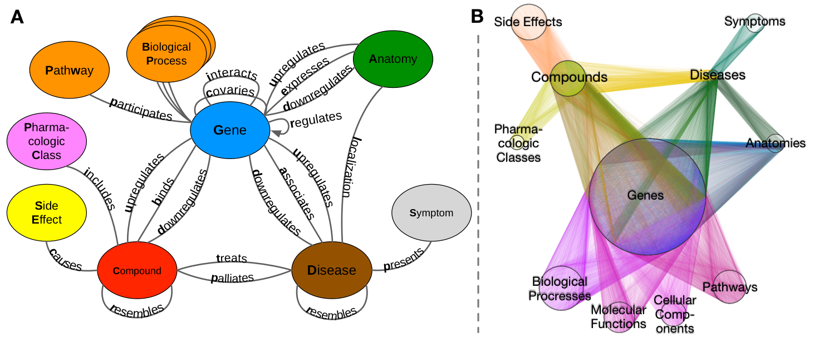
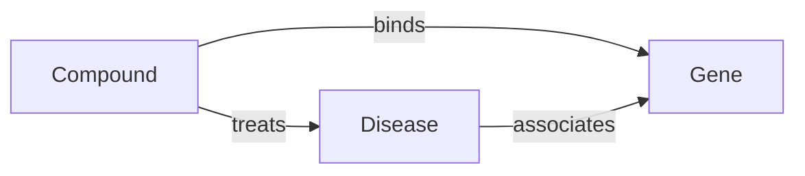
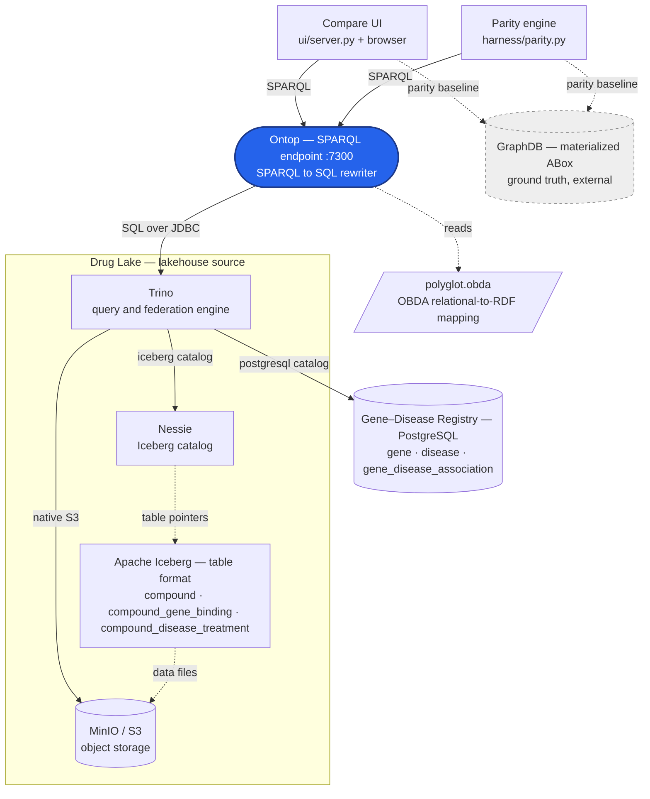
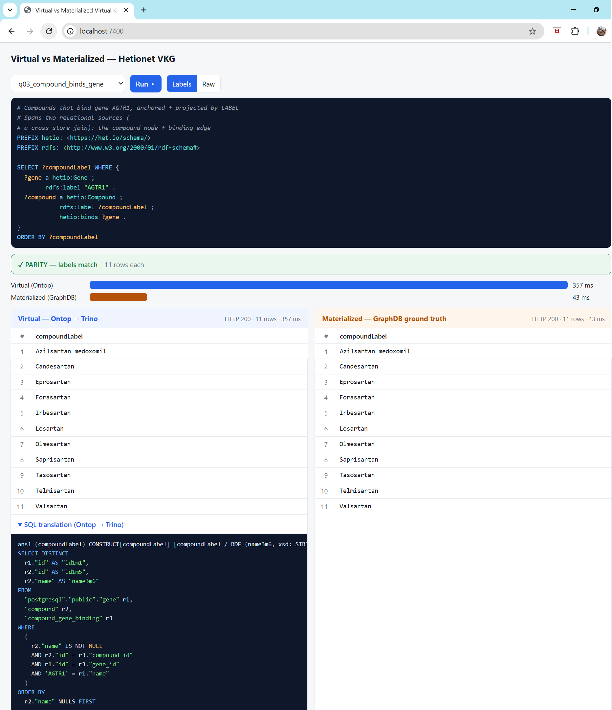
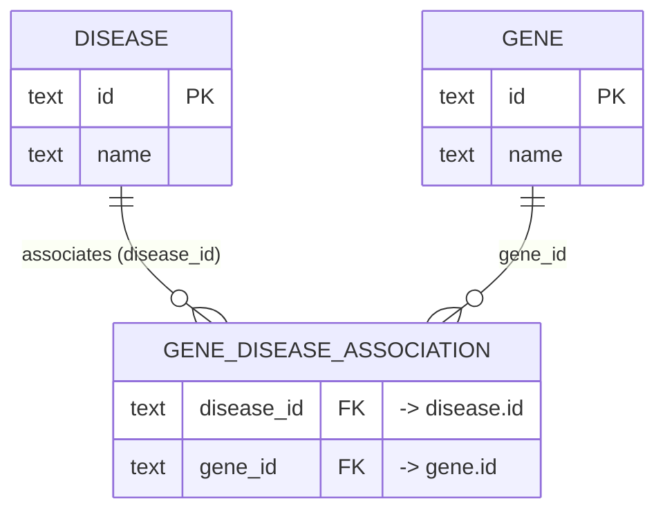
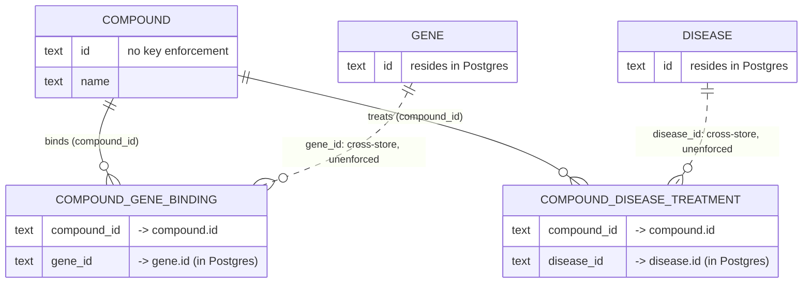
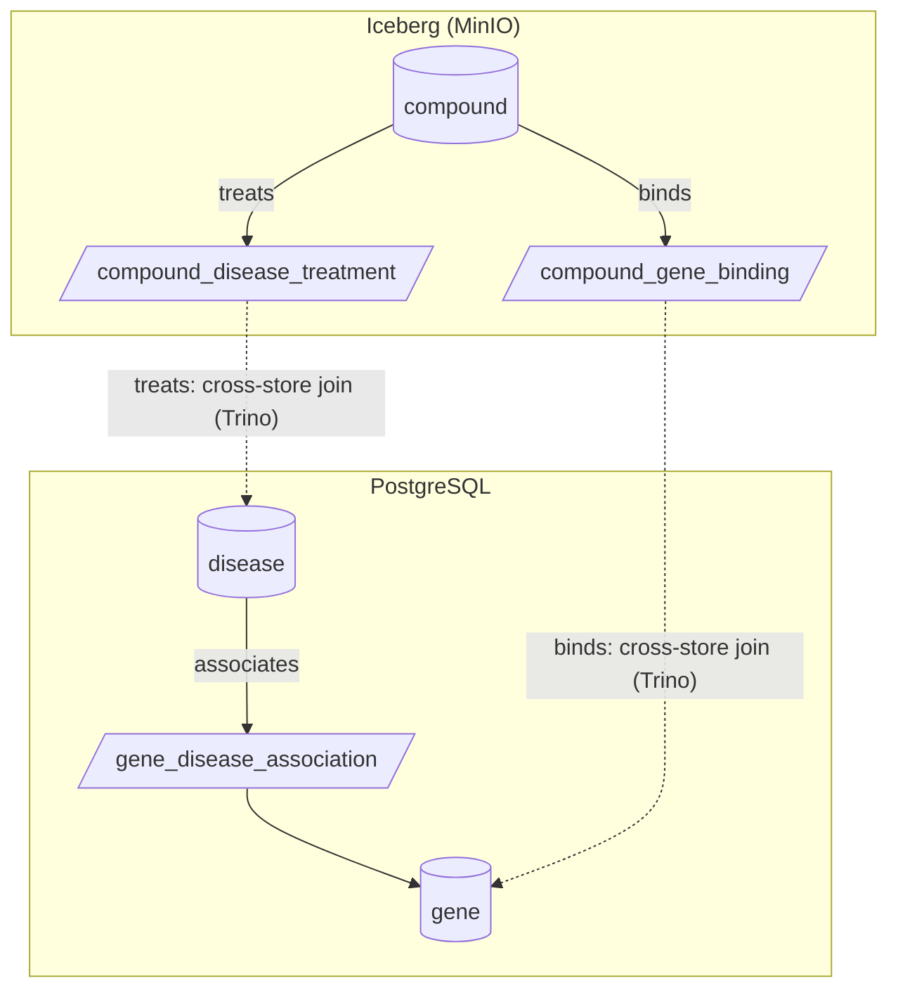

# virtual-knowledge-graph-connectivity

A **Virtual Knowledge Graph (VKG)** reference setup that exercises the *plumbing* of an **Ontology-Based Data Access (OBDA)** architecture over a simulated brownfield analytics stack.
Proves one hand-written SPARQL query resolves unchanged across federated relational + lakehouse sources, validated against a **Materialized Knowledge Graph** ground truth.

## Table of Contents

- [The landscape](#the-landscape)
  - [Components](#components)
- [Ontology (TBox)](#ontology-tbox)
- [Architecture](#architecture)
- [OBDA mapping](#obda-mapping)
- [Virtual vs Materialized Knowledge Graph Results](#virtual-vs-materialized-knowledge-graph-results)
- [Compare UI - Virtual vs Materialized](#compare-ui---virtual-vs-materialized)
- [Information Model on Sources (ERD)](#information-model-on-sources-erd)
  - [Gene Disease Registry - PostgreSQL - ABox](#gene-disease-registry---postgresql---abox)
  - [Drug Lake - Lakehouse (Iceberg, Nessie, MinIO)](#drug-lake---lakehouse-iceberg-nessie-minio)
  - [Combined — where federation happens](#combined--where-federation-happens)
- [The ground truth](#the-ground-truth)
- [Running it](#running-it)

## The landscape

The tech stack at this repo mirrors a brownfield analytics enterprise setup.
The information model is deliberately tiny, three entities and their relationships, to keep the focus on connectivity rather than business rules.
The information model is a slice of [Hetionet](https://het.io/) ([hetio/hetionet](https://github.com/hetio/hetionet)).



### Components

| Purpose | Technology / tool |
|---|---|
| SPARQL Parity Console | Python console app; hits both graphs |
| SPARQL Compare UI | HTML + stdlib Python server (`ui/server.py`); hits both graphs |
| SPARQL endpoint + SPARQL→SQL rewriting | **[Ontop](https://ontop-vkg.org/)** |
| Relational to RDF mapping | **[OBDA](https://ontop-vkg.org/guide/advanced/mapping-language.html)** mapping files (`mappings/*.obda`) |
| SQL federation across sources | **[Trino](https://trino.io/)** |
| Gene Disease Registry  | **[PostgreSQL](https://www.postgresql.org/)** RDBMS |
| Drug Lake   | **Lakehouse** (Iceberg·Nessie·MinIO) |
| Lakehouse table format | **[Apache Iceberg](https://iceberg.apache.org/)** |
| Lakehouse catalog | **[Nessie](https://projectnessie.org/)** |
| Lakehouse Object storage | **[MinIO](https://min.io/)** (S3-compatible) |
| Ground truth store | **[GraphDB](https://www.ontotext.com/products/graphdb/)** (external, not served) |

## Ontology (TBox)

The slice is three classes and minimal properties. 
Reasoning is **off**, so `rdfs:domain`/`rdfs:range` here are documentation of intent, not inference rules.




```turtle
@prefix hetio: <https://het.io/schema/> .
@prefix rdfs:  <http://www.w3.org/2000/01/rdf-schema#> .
@prefix owl:   <http://www.w3.org/2002/07/owl#> .

hetio:Gene     a owl:Class .
hetio:Disease  a owl:Class .
hetio:Compound a owl:Class .

hetio:associates a owl:ObjectProperty ;   # Disease–associates–Gene   (DaG)
    rdfs:domain hetio:Disease  ; rdfs:range hetio:Gene .
hetio:binds      a owl:ObjectProperty ;   # Compound–binds–Gene       (CbG)
    rdfs:domain hetio:Compound ; rdfs:range hetio:Gene .
hetio:treats     a owl:ObjectProperty ;   # Compound–treats–Disease   (CtD)
    rdfs:domain hetio:Compound ; rdfs:range hetio:Disease .
```

## Architecture

SPARQL clients the **compare UI** and the **parity console** hit **one** Ontop endpoint. 

Ontop reads `polyglot.obda` and rewrites SPARQL to SQL against Trino. The mapping is configuration
Ontop consults locally to build that SQL — it is not a network hop, so it never sits between Ontop
and Trino on the wire; the dashed "reads" edge below is a config dependency, not a data-flow step.

Trino is the federation engine and the SQL entry for both the **Drug Lake (Iceberg lakehouse)** and the **Gene–Disease Registry (PostgreSQL)**. 

One **GraphDB instance** (dashed, below) sits off the serving connectivity path; its only purpose is to be the equivalent RDFS Materialized Knowledge Graph the compare UI and parity console diff results against.

It was stood up as part of [biomedical-rag-bench](https://github.com/joseph-higaki/biomedical-rag-bench/tree/v1.1.1).





## OBDA mapping

An **OBDA mapping** is the relational to RDF bridge Ontop uses to rewrite SPARQL into SQL. 

Each `mappingId` is a *triple map*: a **target** RDF template (with `{column}` placeholders) fed by a
**source** SQL query. Ontop never materializes these triples — it composes the maps with the
incoming SPARQL and pushes one SQL query down to the sources.

Each source query uses a fully-qualified Trino identifier (`postgresql.public.*` vs `iceberg.hetionet.*`), which is what lets a single SPARQL query span both stores.
(`iceberg` is the Trino catalog; `hetionet` is the Iceberg schema.)

```
mappingId	compound
target		<https://het.io/compound/{id}> a hetio:Compound ; rdfs:label {name}^^xsd:string .
source		SELECT id, name FROM iceberg.hetionet.compound

mappingId	compound_binds_gene
target		<https://het.io/compound/{compound_id}> hetio:binds <https://het.io/gene/{gene_id}> .
source		SELECT compound_id, gene_id FROM iceberg.hetionet.compound_gene_binding

mappingId	gene
target		<https://het.io/gene/{id}> a hetio:Gene ; rdfs:label {name}^^xsd:string .
source		SELECT id, name FROM postgresql.public.gene
```

The `compound` node + `compound_binds_gene` edge resolve to the Iceberg catalog; `gene` resolves to
Postgres. A SPARQL query touching `hetio:binds` therefore forces Trino to join across both — see
`mappings/polyglot.obda` for the full file.

## Virtual vs Materialized Knowledge Graph Results

The VKG is **correct if it returns the same bindings as the GraphDB ground truth**, compared on the
**label projection** (the human-readable `?xLabel` columns). 

Entity IRIs are *not* compared — Ontop mints its own scheme (`https://het.io/…`) while the GraphDB ground truth uses `ncbigene:`/`do:` URIs. Reconciling those is a benchmark-integration concern, not a connectivity one. Queries bind entities **by label, not by IRI**, so one `.rq` runs unchanged on both endpoints and the parity comparison never sees an IRI.

**Reconciling IRIs is a much bigger problem; this repo tackles only tooling and connectivity.**

## Compare UI - Virtual vs Materialized

`make ui-app` serves a local page (<http://localhost:7400/>) that runs one query against **both**
engines side by side: the **Virtual** VKG (Ontop → Trino → ( Postgres + Iceberg) ) vs the
**Materialized** GraphDB, each endpoint's telemetry, a latency bar, the parity verdict, and the SQL
Ontop pushed down. 




## Information Model on Sources (ERD)

**Dashed** relationships are **cross-store** — a foreign key whose target table lives in the *other* database, which no RDBMS enforces.

**Those dashed edges are the joins Trino federates**.

### Gene Disease Registry - PostgreSQL - ABox



### Drug Lake - Lakehouse (Iceberg, Nessie, MinIO)



### Combined — where federation happens

Solid edges stay inside one store; the two dashed edges cross the boundary and are exactly what
Trino federates. Node tables are cylinders, association (junction) tables are parallelograms.



## The ground truth 

By default the harness points at your **existing biomedical-rag-bench GraphDB** (`GROUND_TRUTH_SPARQL_URL` in
`secrets/.env`, base `http://localhost:7200/`). Because that graph and the SQL tables come from different provenance paths, parity is compared on labels. For a clean-provenance local baseline, a
smoke (partial) and full ABox RDF are under `data/hetionet/rdf/`.

## Running it

All run commands — the rung ladder and per-layer `make` targets — are documented in [docs/how-to-run-ui.md](docs/how-to-run-ui.md) and [docs/staggered-execution.md](docs/staggered-execution.md).

