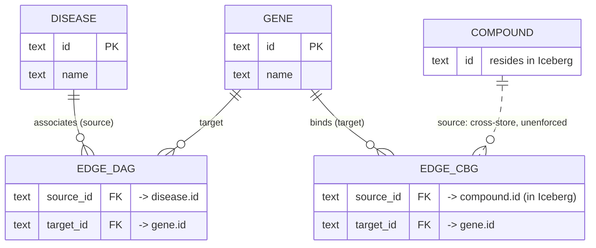
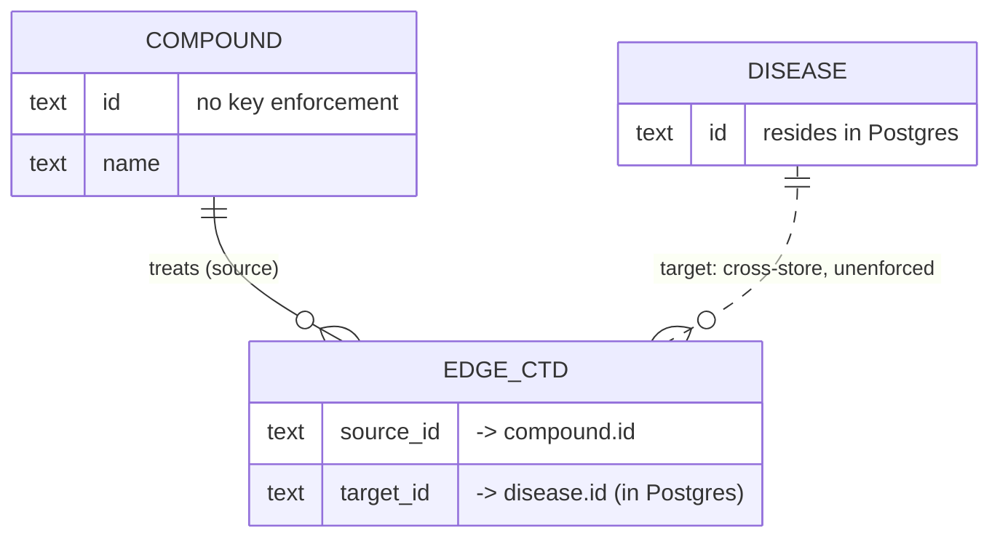
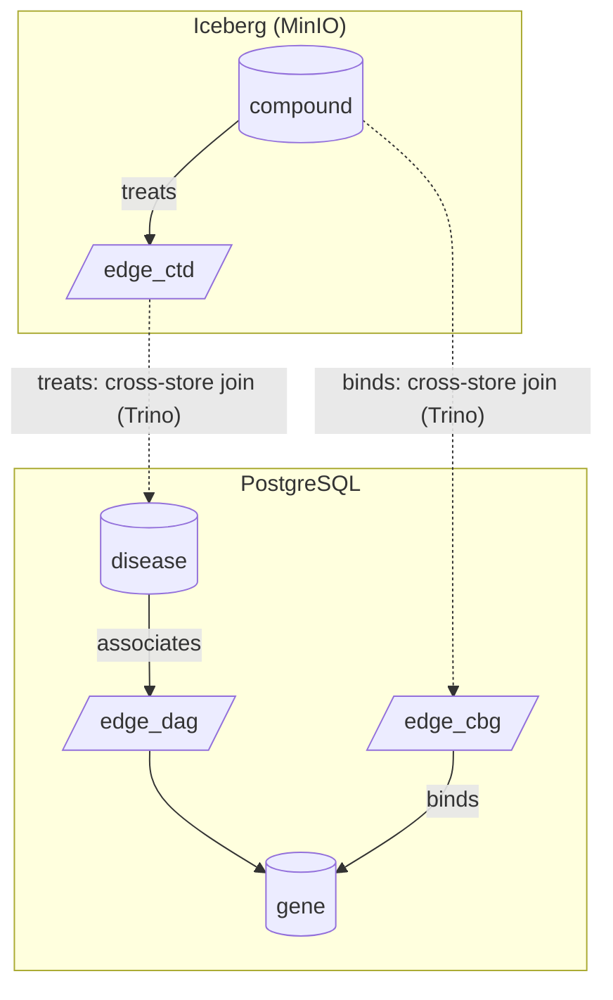

# virtual-knowledge-graph-connectivity

A focused harness that de-risks the **Virtual Knowledge Graph (OBDA)** plumbing for
`biomedical-rag-bench` Project 2, in isolation from the benchmark's retriever and eval code.
It proves that a hand-written SPARQL query resolves — unchanged — down through
**standalone Ontop → Trino → a polyglot ABox (PostgreSQL + Apache Iceberg on MinIO)**, and that
the bindings match a trusted GraphDB baseline.

## What this tests, precisely

 serving topology 
 GraphDB in graph materialized Abox 
 vs
VKG poliglot queries

Because the query is fixed and human-authored, and reasoning is off, any difference in results
between rungs is caused by the **serving layer alone**. That is the entire point.

## The invariant: parity, not improvement

A rung is **correct iff it returns the same bindings as the GraphDB ground truth**, compared on the
**label projection** (the human-readable `?xLabel` columns), modulo ordering. Entity IRIs are
*not* compared — Ontop mints its own IRI scheme here, and matching Project-1's exact
URIs is a benchmark-integration concern, not a connectivity one.

The only metric that legitimately moves between rungs is **virtualization fidelity loss** — rows
the ground truth returns that Ontop drops (a mapping gap, a type coercion, or a join-pushdown limit).
That is a data-quality number, reported as such. "Same results as GraphDB" is a PASS.

## Architecture

```
        hand-written .rq (queries/)
                 │
                 ▼
        ┌──────────────────┐         ┌──────────────────────────┐
        │  standalone Ontop│  ── vs ─│  GraphDB ground truth    │
        │  (system under   │  parity │  (materialized RDFS ABox)│
        │   test)          │  on     └──────────────────────────┘
        └────────┬─────────┘  labels
                 │ SQL
        rung 2 ──┤ (JDBC → Postgres directly)
        rung 3 ──┤ (JDBC → Trino ─→ iceberg catalog ─→ MinIO)
        rung 4 ──┘ (JDBC → Trino ─→ postgresql + iceberg catalogs)
```

**Ontop** is the SPARQL↔SQL layer and binds to **one** SQL source per instance. **Trino** is the
federation layer that presents Postgres + Iceberg as one SQL surface for Ontop to map over. They
are stacked, not alternatives — Trino speaks no SPARQL and knows nothing of the ontology, so it
cannot replace Ontop; Ontop speaks no S3/Iceberg, so it cannot replace Trino.

**Iceberg is always fronted by Trino.** Iceberg is a table format with no query engine of its
own, so there is no "Ontop → Iceberg" path — Trino's Iceberg connector reads it from MinIO.

## Data

Source of truth is the Hetionet **TSV** distribution (topology + labels), **not** the metagraph
JSON (which is the schema, not instances):

- `hetionet-v1.0-nodes.tsv` — `id` (e.g. `Gene::5743`), `name`, `kind`
- `hetionet-v1.0-edges.sif.gz` — `source`, `metaedge` (abbreviation), `target`

These are already relational, so loading is two flat files, not a triple-to-table transform. Node
and edge **attributes** (chromosome, inchikey, description, url) are absent from the TSVs — they
live only in the full JSON and are **out of scope** here.

This repo loads a representative **slice**: nodes `{Gene, Disease, Compound}`, edges
`{Disease–associates–Gene, Compound–binds–Gene, Compound–treats–Disease}`, distributed so that at
least one edge on each store forces a cross-store join. See `STRUCTURE.md` for the table layout.

## Relational model (ERD)

Mermaid's `erDiagram` cannot group entities into bounded per-database boxes — grouping exists only
in `flowchart` — so each store gets its own ERD, followed by a combined boundary view that shows
where the two must be federated.

Enforced keys (`PK`/`FK`) are shown only for PostgreSQL. **Iceberg enforces neither**: identifiers
there are advisory and referential integrity is the query engine's problem, not the store's.
**Dashed** relationships are **cross-store** — a foreign key whose target table lives in the *other*
database, which no RDBMS enforces. Those dashed edges are the joins Trino resolves at rung 4.

### PostgreSQL



### Iceberg (on MinIO)



### Combined — where federation happens

Solid edges stay inside one store; the two dashed edges cross the boundary and are exactly what
Trino federates at rung 4. Node tables are cylinders, edge (association) tables are parallelograms.



## The ground truth

By default the harness points at your **existing Project-1 GraphDB** (`GROUND_TRUTH_SPARQL_URL` in
`secrets/.env`, base `http://localhost:7200/`). Because that graph and the SQL tables come from different provenance paths, parity is
compared on labels 
For reference smoke (partial) and full ABOX RDF is data/hetionet/rdf 


## Running it

Prereqs: Docker + Docker Compose, Python 3.11+, `make`. Config/secrets live in `secrets/.env`
(copy from `secrets/.env.example`).

### Rung 0 — liveness (Ontop → Postgres)

```
make deps        # .venv (editable install) + pinned Postgres JDBC driver — one-time
make up-rung0    # start Postgres (self-seeds 8 genes via initdb) + standalone Ontop
make test-rung0  # q08 (SELECT * LIMIT 1) returns a binding → endpoint is live
make smoke       # same query, prints rows + telemetry dict
make ui          # prints the Ontop console URL
```

The SPARQL console is Ontop's built-in **YASGUI** at <http://localhost:7300/> — syntax
highlighting out of the box. Right-click the editor → **View SQL translation** to see the
SPARQL→SQL rewrite Ontop pushes to the source. `make down` stops containers (keeps data);
`make clean` also drops the `pgdata` volume (forces a re-seed on next `up`).

Rungs 2–4: TBD.

## Explicitly out of scope (deferred, on purpose)

- **LLM SPARQL writer** — connectivity is validated with human-written queries.
- **OWL reasoning** — Project 3.
- **Node/edge attributes** — not in the TSVs; add from JSON later if a query needs them.
- **All 24 metaedges** — the slice proves the pattern; expansion is mechanical.
- **Cross-database foreign keys / persistent identifiers.** An edge table in one store with a
  key into a node table in another cannot be enforced by either RDBMS — the only key that
  survives the boundary is the node's global identifier, which Trino joins on as a bare string.
  That id-as-global-key is the FAIR **Interoperability** seam where persistent identifiers and
  controlled vocabularies enter a later project. Here, joins are unenforced by design.
- **GraphDB-embedded Ontop** — standalone Ontop exposes the same SPARQL endpoint; swapping to
  GraphDB's virtual repository later is an endpoint-level change, not a rewrite.

