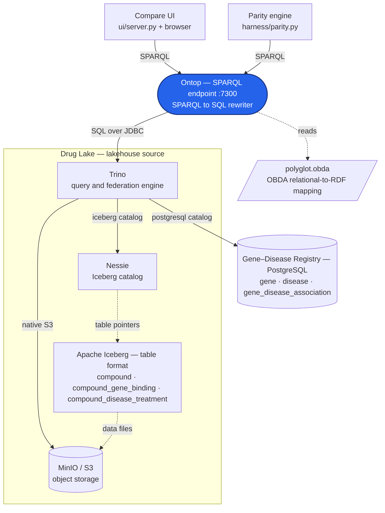
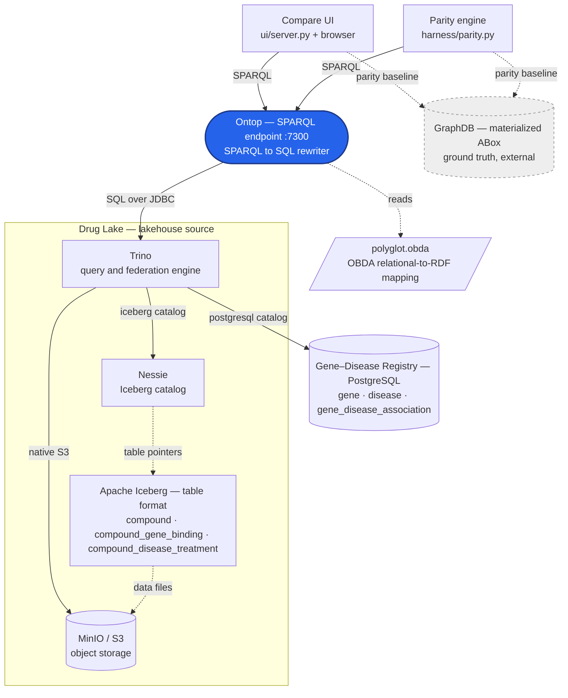

# Architecture — the final (polyglot) state

This is the rung-4 state of the repo: **one** Ontop SPARQL endpoint over **one** Trino, which
federates a proprietary PostgreSQL source and a lakehouse (Iceberg on MinIO, catalogued by Nessie).
GraphDB is **not** part of the served system — it exists only as the parity baseline the tests
compare against. Two diagrams follow: the deployed serving path, and the same path with the
ground-truth baseline the harness adds.

## Reading the diagram

- **Ontop is the single SPARQL entry point.** It is a rewriter, not a store and not a federation
  engine: it holds **one** JDBC connection (to Trino) and turns incoming SPARQL into one SQL query.
- **The OBDA mapping is configuration Ontop reads**, not data it materializes. `polyglot.obda`
  declares the relational→RDF triple maps; Ontop composes them with each query at request time.
- **Two clients, one endpoint.** The **compare UI** (`ui/server.py` + browser) and the **parity
  engine** (`harness/parity.py`) are independent SPARQL clients of the Ontop endpoint. In the
  ground-truth variant they *also* query GraphDB, purely to diff the results.
- **The lakehouse is a bundle.** "Drug Lake" is Trino + Nessie + Iceberg + MinIO/S3 drawn as one
  source. Trino is the SQL entry to that bundle **and** the federation engine: it reaches back out to
  the pre-existing PostgreSQL source as a second catalog. That Trino-adopts-Postgres shape is the
  brownfield decision recorded in [polyglot-layer-choice.md](polyglot-layer-choice.md) — Postgres
  exists first; Trino is introduced for the lake and adopts Postgres rather than the reverse.
- **Logical source names** (proposed, rename freely): **Gene–Disease Registry** for the PostgreSQL
  source (`gene`, `disease`, `gene_disease_association`) and **Drug Lake** for the lakehouse
  (`compound` + both compound edges). They stand in for the real-world stores a VKG would span.

## Version 1 — serving path (no ground truth)

The architecture as it would be deployed. Everything here is on the request path for a SPARQL query.

## Version 2 — with GraphDB ground truth (the test harness)

Same serving path, plus the baseline the parity check needs. GraphDB (dashed, external) is queried
by **both** clients only so their Ontop results can be diffed against a trusted materialized ABox.
Nothing on the serving path depends on it.

## The federation seam

The whole point sits in the two `trino --> pg` / `trino --> minio` legs. A SPARQL query touching
`hetio:binds` or `hetio:treats` names a compound (Drug Lake / Iceberg) *and* a gene or disease
(Gene–Disease Registry / Postgres). Ontop cannot join across stores — it emits one SQL query and
hands it to Trino, which scans **both** catalogs and does the join. That cross-catalog scan is what
`make explain-rung4` proves. See [staggered-execution.md](staggered-execution.md) for how the layers
are brought up and validated.
